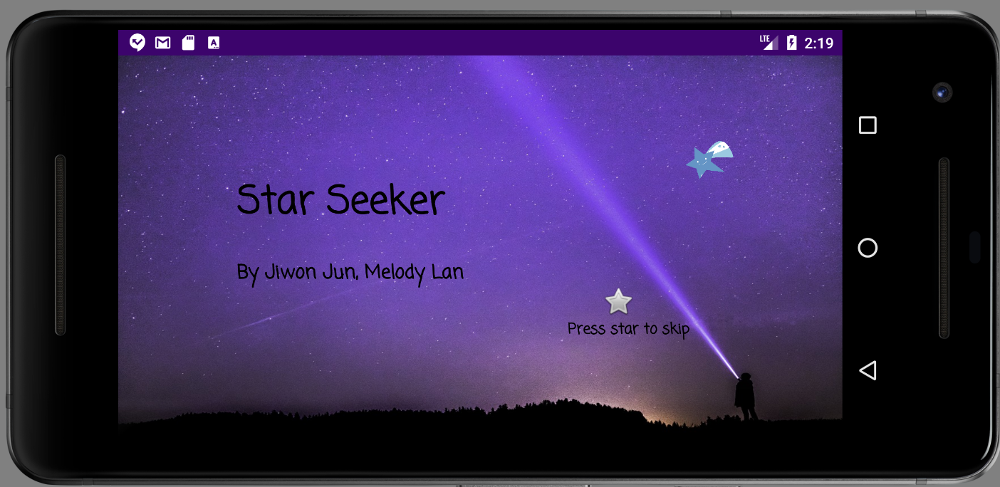
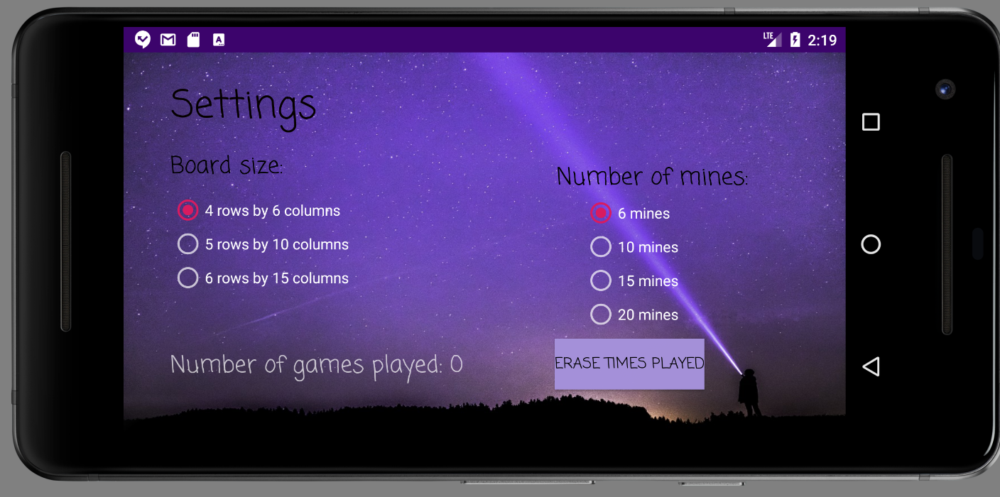
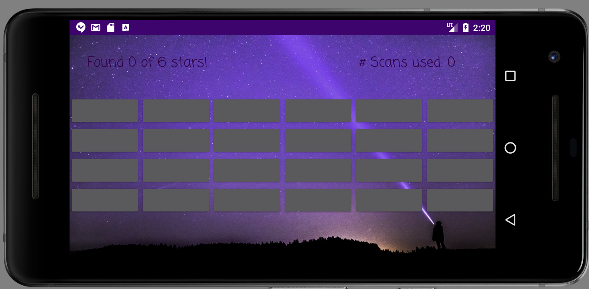
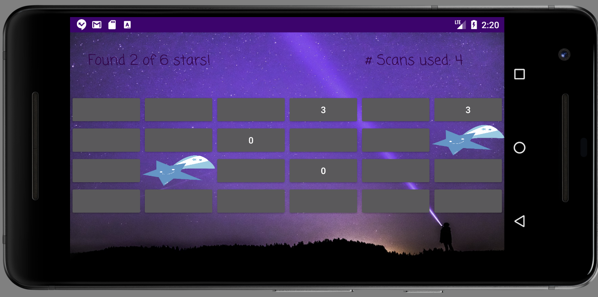

# Star Seeker

A single-player puzzle game created with Android Studio.

## Game Description

The player's goal is to find a certain number of randomly hidden stars on the game board. 

 

When the player taps on a cell with a star, then a star is revealed. But if there is no star, then the cell displays the count of hidden stars in the same row and column of the selected cell. 

 

Using such hints about the number of stars remaining on the cell, the player must find all the stars with the minimum number of scans.

## Screenshots

    
    
    
    

